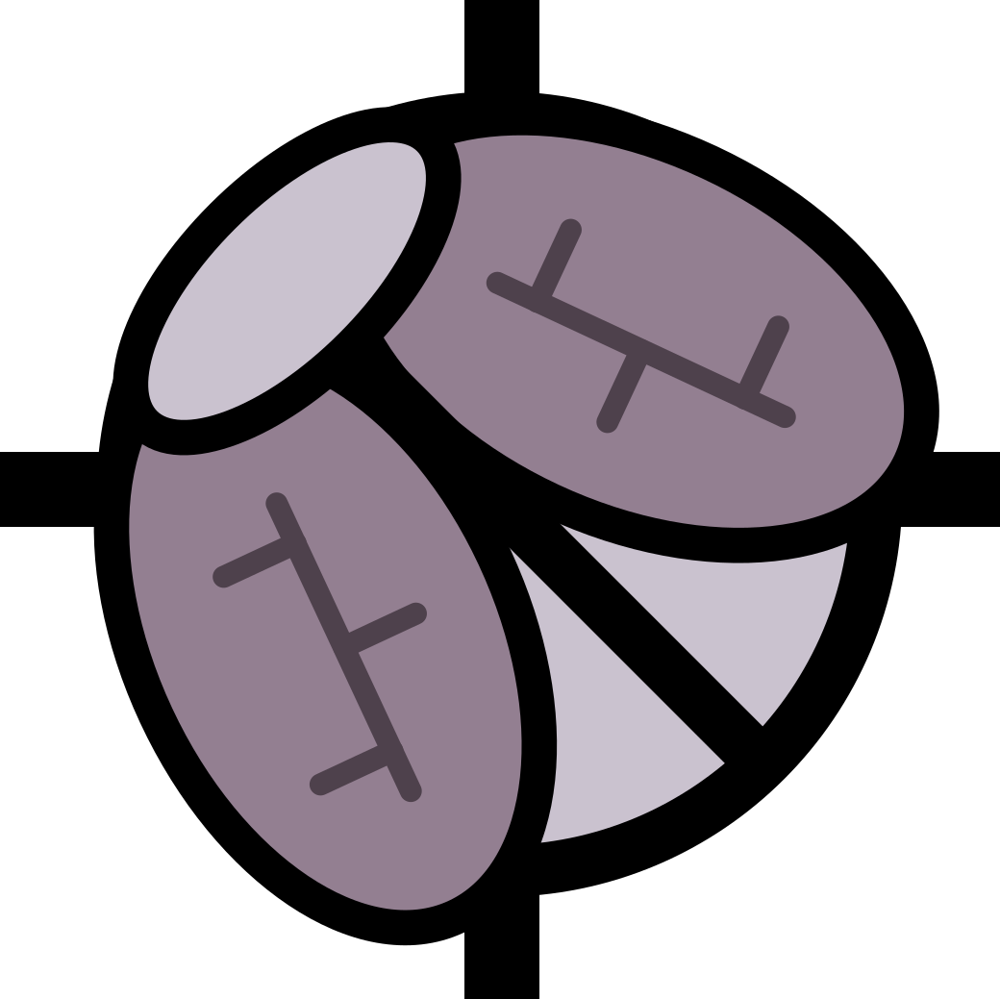

[](https://github.com/YuP2905/elytra-component) [](https://www.python.org/downloads/release/python-3120/) [](#installation)

`elytra-component` is a Python toolkit for batch building performance simulation. It is used to run Honeybee Energy and Honeybee Radiance workflows outside Rhino and Grasshopper.

It focuses on OpenStudio / EnergyPlus and Radiance batch simulation and result reading.

## Scope

- Use HBJSON models as input, use Honeybee Energy to generate OpenStudio Workflow / EnergyPlus simulation files, and run energy simulations.
- Use HBJSON models as input, use Honeybee Radiance and lbt-recipes to organize and run Radiance daylight simulation recipes.
- Read EnergyPlus / OpenStudio output files, including SQL, RDD, ZSZ, and HTML reports.
- Read Radiance recipe output folders, including annual daylight, point-in-time, daylight factor, irradiance, cumulative radiation, and direct sun-hours results.
- Compute daylight metrics such as DA, cDA, UDI, ASE, and sDA from Radiance annual illuminance matrices.
- Support parametric studies, batch simulation, and result aggregation. It can be used as a simulation evaluation backend for optimization algorithms, machine learning, deep learning, reinforcement learning, and similar methods, providing reusable result data and performance metrics.

`elytra-component` is a lightweight wrapper layer built on top of the Ladybug Tools ecosystem. It does not reimplement the core capabilities of Honeybee, OpenStudio, EnergyPlus, Radiance, or lbt-recipes. Instead, it provides Python interfaces that are more suitable for batch simulation, scripted execution, and result reading on top of these official tools and runtimes.

The goal of this package is to reuse and organize upstream project capabilities, not to replace or weaken upstream project contributions. The related simulation capabilities, model structures, recipe system, and runtimes all come from Ladybug Tools and its official dependency ecosystem.

`elytra-component` is not responsible for Honeybee model creation, general geometry modeling, or visualization wrappers. It also does not replace Honeybee, OpenStudio, EnergyPlus, Radiance, or lbt-recipes.

This package uses existing HBJSON files as input. HBJSON files can come from Rhino/Grasshopper, the Honeybee Python SDK, or any other modeling workflow compatible with Honeybee Schema.

## Installation

Install the latest version directly from GitHub with `pip`:

```cmd
pip install git+https://github.com/YuP2905/elytra-component.git
```

For projects managed by `uv`:

```cmd
uv add git+https://github.com/YuP2905/elytra-component.git
```

To download the source code and install it locally:

```cmd
git clone https://github.com/YuP2905/elytra-component.git
cd elytra-component
pip install .
```

For an editable development installation:

```cmd
pip install -e .
```

These commands install `elytra-component` and its Python dependencies from the GitHub repository. Python 3.12 is required.

The Python package itself does not include the OpenStudio, EnergyPlus, or Radiance runtimes. To run new Energy or Radiance simulations, make sure the target environment already has the corresponding simulation engines installed and configured.

If you only read existing simulation results, OpenStudio, EnergyPlus, and Radiance do not need to be configured.

## Runtime Modes

`elytra-component` supports three usage modes:

1. [Mode 1: Ladybug Tools / Pollination](#mode-1-ladybug-tools--pollination)
2. [Mode 2: Manual OpenStudio, EnergyPlus, and Radiance Configuration](#mode-2-manual-openstudio-energyplus-and-radiance-configuration)
3. [Mode 3: Read Existing Simulation Results Only](#mode-3-read-existing-simulation-results-only)

The first two modes can run Energy and Radiance simulations. The third mode only uses result reading and post-processing features.

## Mode 1: Ladybug Tools / Pollination

On Windows, the official Ladybug Tools / Pollination installation is recommended as the simulation runtime source.

The default installation root is usually:

```text
%LBT_ROOT% = C:\Program Files\ladybug_tools
```

This installation folder contains OpenStudio, EnergyPlus, Radiance, OpenStudio measures, and the official Ladybug Tools Python environment. `elytra-component` does not run inside Rhino or Grasshopper, and it does not depend on Grasshopper component execution logic. It only reuses the simulation runtimes and resource files in this installation folder.

Therefore, Rhino / Grasshopper can be used as a source of HBJSON models, but it is not the runtime environment of `elytra-component`.

The paths directly related to this package are mainly:

```text
%LBT_ROOT%
├─ openstudio
│  ├─ bin
│  └─ EnergyPlus
├─ radiance
│  ├─ bin
│  └─ lib
└─ resources
   └─ measures
```

Where:

- `openstudio\bin` provides `openstudio.exe`, which is used to run OpenStudio workflows.
- `openstudio\EnergyPlus` provides the EnergyPlus runtime bundled with OpenStudio.
- `radiance\bin` provides Radiance command-line tools.
- `radiance\lib` provides the library files required by Radiance.
- `resources\measures` provides the measures used by Honeybee Energy / OpenStudio workflows.

## Mode 2: Manual OpenStudio, EnergyPlus, and Radiance Configuration

If you do not use the runtimes from a Ladybug Tools / Pollination installation, you can manually configure OpenStudio, EnergyPlus, and Radiance.

For `elytra-component 0.1.0`, the following versions are recommended:

```text
OpenStudio CLI: 3.10.0
OpenStudio bundled EnergyPlus: 25.1.0
Radiance: 5.4, 2023-11-05 LBNL
```

If you use other versions, validate them yourself.

### Configure OpenStudio and EnergyPlus

Honeybee Energy resolves OpenStudio and EnergyPlus paths through `honeybee_energy.config`:

```python
from honeybee_energy.config import folders

print(folders.openstudio_path)
print(folders.openstudio_exe)
print(folders.openstudio_version_str)
print(folders.energyplus_path)
print(folders.energyplus_exe)
print(folders.energyplus_version_str)
```

If the resolved runtime is not the target runtime, set it explicitly before running simulations:

```python
from honeybee_energy.config import folders

folders.openstudio_path = r"C:\path\to\openstudio\bin"
folders.energyplus_path = r"C:\path\to\openstudio\EnergyPlus"
```

Here, `openstudio_path` should point to the folder containing `openstudio.exe`, and `energyplus_path` should point to the folder containing `energyplus.exe` and `Energy+.idd`.

### Configure Radiance

Honeybee Radiance resolves Radiance paths through `honeybee_radiance.config`:

```python
from honeybee_radiance.config import folders

print(folders.radiance_path)
print(folders.radbin_path)
print(folders.radlib_path)
print(folders.radiance_version_str)
```

If the resolved runtime is not the target runtime, set the Radiance root directory explicitly before running simulations:

```python
from honeybee_radiance.config import folders

folders.radiance_path = r"C:\path\to\radiance"
```

The Radiance root directory should contain both `bin` and `lib` subfolders. `radbin_path` should point to the Radiance command-line tool folder, and `radlib_path` should point to the Radiance library folder.

`RAYPATH` only affects the Radiance library search path and cannot replace `radbin_path`.

## Mode 3: Read Existing Simulation Results Only

If Energy or Radiance simulations have already been completed in another environment, you can use only the result reading and post-processing features of `elytra-component`.

This mode does not require OpenStudio, EnergyPlus, or Radiance runtimes to be configured.

Readable results include:

- EnergyPlus / OpenStudio output files, such as SQL, RDD, ZSZ, and HTML reports.
- Radiance recipe output folders, such as annual daylight, point-in-time, daylight factor, irradiance, cumulative radiation, and direct sun-hours results.
- Radiance annual illuminance matrices, from which DA, cDA, UDI, ASE, sDA, and other metrics can be computed.

This mode can only read and process existing results. It cannot run new Energy or Radiance simulations.
